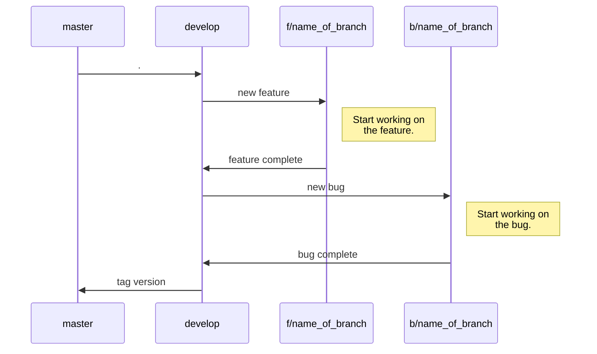

# Git Flow

Branch Naming
   feature -> f/[Sprint Number]/name_of_branch\
   bug -> b/[Sprint Number]/name_of_branch\
   quickfix -> q/[Sprint Number]/name_of_branch\

```mermaid
sequenceDiagram
master ->> develop:.

develop ->> f/name_of_branch: new feature
Note right of f/name_of_branch: Start working on<br/>the feature.
f/name_of_branch ->> develop: feature complete
develop ->> b/name_of_branch: new bug
Note right of b/name_of_branch: Start working on<br/>the bug.
b/name_of_branch ->> develop: bug complete
develop ->> master: tag version
```